# Create and Deploy an app in IBM Code Engine using IBM Bob

This article demonstrates how IBM Bob is leveraged to build a simple Python  Flask web application, containerizing it using Podman, pushing the container image to IBM Container Registry, and deploying it on IBM Code Engine. 

## 🏗️ Architecture Diagram

```
┌─────────────────────────────────────────────────────────────────-┐
│                     Development Environment                      │
│                                                                  │
│  ┌──────────────┐      ┌──────────────┐      ┌──────────────┐    │
│  │   app.py     │      │ Dockerfile   │      │requirements  │    │
│  │  (Flask App) │      │              │      │    .txt      │    │
│  └──────────────┘      └──────────────┘      └──────────────┘    │
│         │                      │                      │          │
│         └──────────────────────┴──────────────────────┘          │
│                                │                                 │
└────────────────────────────────┼─────────────────────────────────┘
                                 │
                                 ▼
                    ┌────────────────────────┐
                    │   Podman Build         │
                    │   (Container Image)    │
                    └────────────────────────┘
                                 │
                                 ▼
┌────────────────────────────────────────────────────────────────-─┐
│                    IBM Container Registry                        │
│                    (us.icr.io)                                   │
│                                                                  │
│  Namespace: cr-itz-3uehbja7                                      │
│  Image: python-web-app:latest                                    │
│                                                                  │
└────────────────────────────────┬────────────────────────────────-┘
                                 │
                                 ▼
┌─────────────────────────────────────────────────────────────────┐
│                      IBM Code Engine                            │
│                                                                 │
│  ┌────────────────────────────────────────────────────────┐     │
│  │  Project: python-web-app-project                       │     │
│  │  Resource Group: itz-wxo-697b4e2bf2289c92dfa7cf        │     │
│  │                                                        │     │
│  │  ┌──────────────────────────────────────────────┐      │     │
│  │  │  Application: python-web-app                 │      │     │
│  │  │  Port: 8080                                  │      │     │
│  │  │  Auto-scaling: Enabled                       │      │     │
│  │  └──────────────────────────────────────────────┘      │     │
│  └────────────────────────────────────────────────────────┘     │
│                                                                 │
└────────────────────────────────┬────────────────────────────────┘
                                 │
                                 ▼
                    ┌────────────────────────┐
                    │   Public Endpoint      │
                    │   (HTTPS URL)          │
                    └────────────────────────┘
                                 │
                                 ▼
                         ┌──────────────┐
                         │   End Users  │
                         └──────────────┘
```

## 🛠️ Tech Stack

### Application Layer
- **Language**: Python 3.11
- **Framework**: Flask 3.0.0
- **Web Server**: Werkzeug 3.0.1

### Containerization
- **Container Runtime**: Podman
- **Base Image**: python:3.11-slim
- **Container Registry**: IBM Container Registry (ICR)

### Cloud Infrastructure
- **Cloud Provider**: IBM Cloud
- **Compute Service**: IBM Code Engine
- **Container Registry**: IBM Container Registry (us.icr.io)
- **Region**: us-south
- **Resource Group**: itz-wxo-697b4e2bf2289c92dfa7cf

### DevOps Tools
- **CLI**: IBM Cloud CLI
- **Plugins**: 
  - code-engine
  - container-registry
- **Authentication**: IBM Cloud API Key


## Building the App Using Bob

### 1. Provide the Initial Prompt to Bob

- The following prompt was entered to request Bob to create the app:

```
Generate a simple web app using python.
Containerize the app and push it to IBM Container Registry.
Deploy the app in IBM Code Engine.
The Resource-Group for the IBM Container Registry and IBM Code Engine is "itz-wxo-697b4e2bf2289c92dfa7cf".
The namespace for IBM Container Registry is "cr-itz-3uehbja7".
The API Key for IBM Cloud is "xxxxxxxxxxx"

```

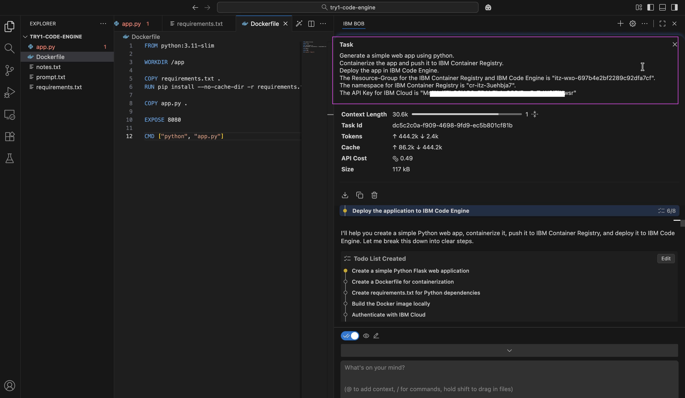

### 2. Review and Approve the To‑Do List

- Bob generated a to‑do list based on the provided prompt.

- Bob was then prompted with `I dont have the docker in my local Mac, but I have PodMan.`

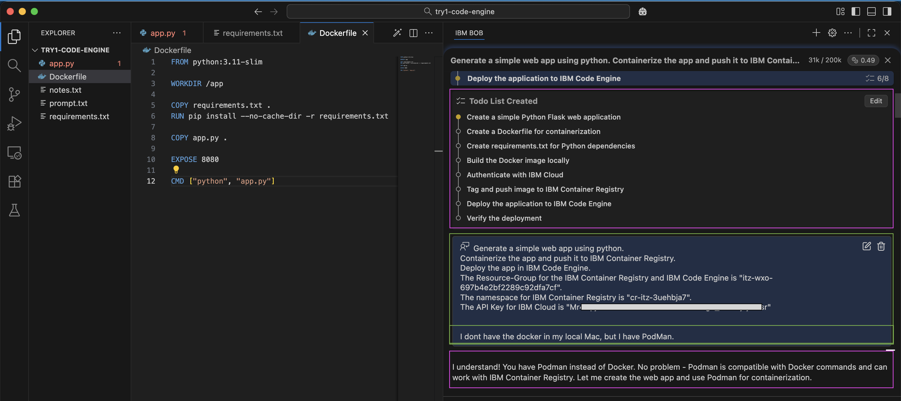

- Based on this update, Bob generated a revised to‑do list.

- The updated to‑do list was reviewed and approved.

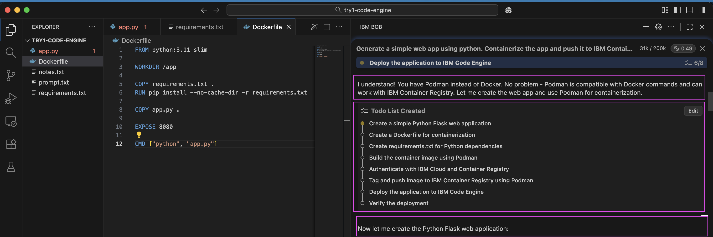

### 3. Creating the App

- Bob created the web application.

- Bob updated the to‑do list accordingly.

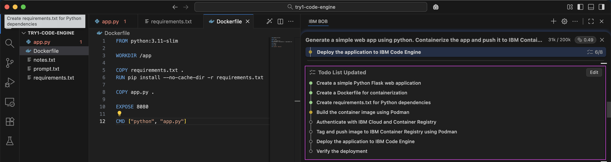

### 4. Building the Container Image

- Bob built the container image using Podman

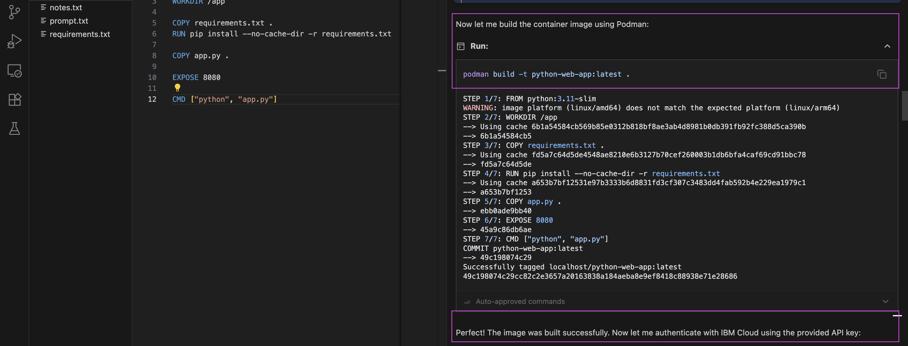

### 5. IBM Code Engine login

- Bob logged in to IBM Code Engine using the provided API key

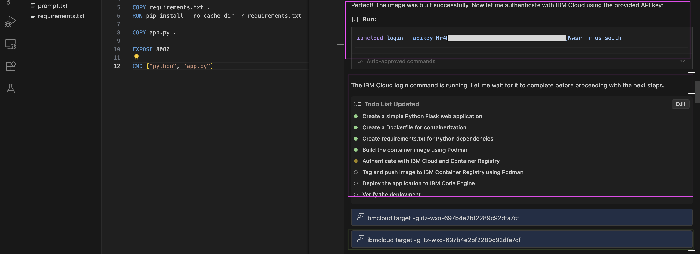

### 6. Target Resource Group

- Bob set the target resource group.

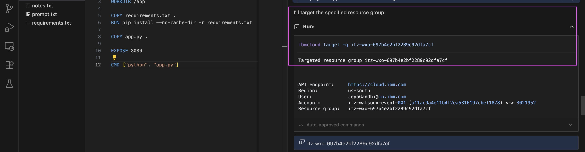

### 6. Container Registry login

- Bob logged in to the IBM Container Registry

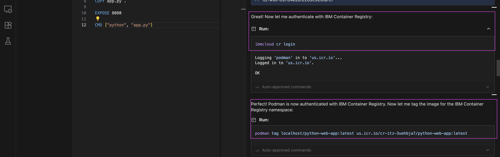

### 7. Push Image to Container Registry

- Bob pushed the container image to the IBM Container Registry

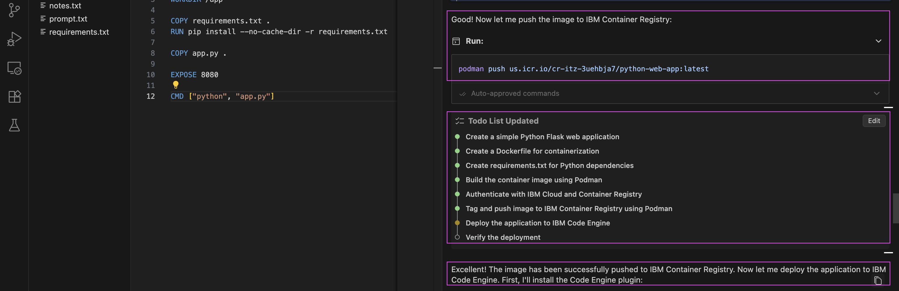

### 8. Creating a Project in IBM Code Engine

- Bob created a project in IBM Code Engine.

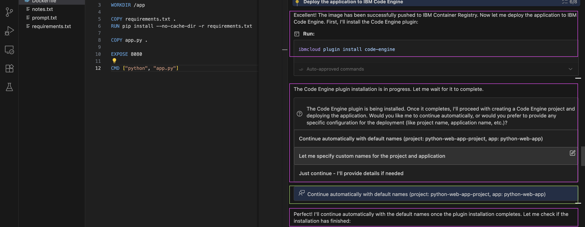

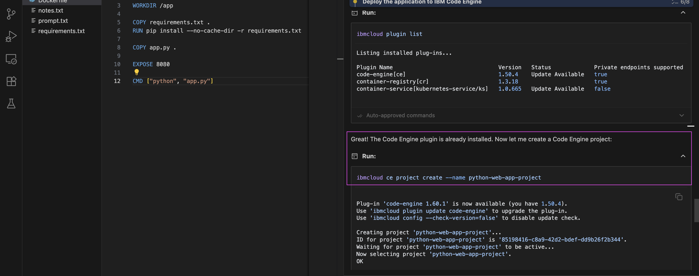

### 9. Creating the App in IBM Code Engine

- Bob created the application in IBM Code Engine using the provided container image.

- Bob displayed the application URL after deployment.

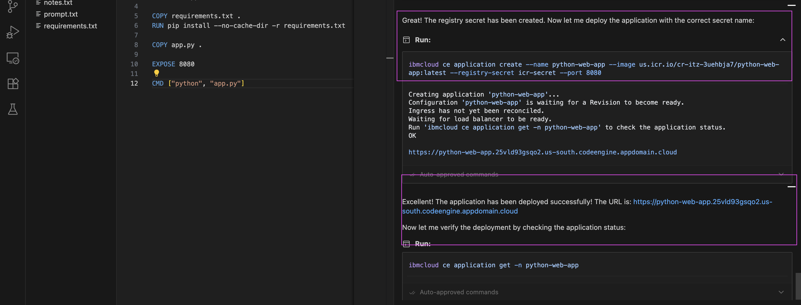

- The application was successfully deployed to IBM Code Engine.

### 10. Final Output

- All generated source code and Markdown documentation files are now available in the [/project](project) folder.
